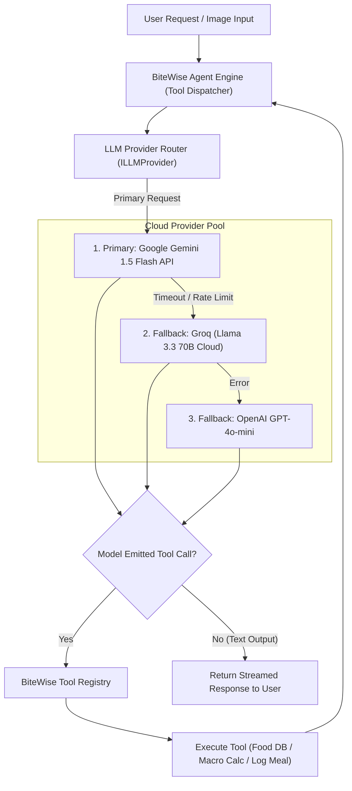

# BiteWise - AI & Agent Architecture Specification (`AI_ARCHITECTURE.md`)

## 1. Overview & Cloud-Only Policy

BiteWise implements a robust **Agentic AI Architecture** powered strictly by cloud-hosted Large Language Models (LLMs).
- **Strict Constraint**: No Ollama, no local LLM engines, and no client-side model execution.
- **Provider Multi-Tenant Adapter**: All AI capabilities are mediated through a unified interface (`ILLMProvider`), preventing vendor lock-in and guaranteeing 99.9% availability through automated failover.

---

## 2. LLM Provider Abstraction & Failover Architecture



---

## 3. Agent Tool Definitions & Registry

The BiteWise Agent is equipped with deterministic, typed tools defined using **Zod Schemas**. When the LLM decides to invoke a tool, the Agent execution runtime executes the corresponding backend service and returns the structured observation to the LLM.

### Tool 1: `search_food_database`
- **Description**: Queries external food data providers (USDA, Open Food Facts) and internal cache for verified nutritional information.
- **Schema**:
```typescript
import { z } from 'zod';

export const SearchFoodDatabaseSchema = z.object({
  query: z.string().describe('The name or query string of the food item (e.g. "greek yogurt", "avocado")'),
  limit: z.number().optional().default(5).describe('Maximum number of matches to return')
});

export type SearchFoodDatabaseInput = z.infer<typeof SearchFoodDatabaseSchema>;
```

---

### Tool 2: `calculate_macros`
- **Description**: Calculates Basal Metabolic Rate (BMR), Total Daily Energy Expenditure (TDEE), and target macronutrients (Protein, Carbs, Fat) using the Mifflin-St Jeor equation.
- **Schema**:
```typescript
export const CalculateMacrosSchema = z.object({
  age: z.number().min(15).max(100),
  gender: z.enum(['male', 'female', 'other']),
  weightKg: z.number().positive(),
  heightCm: z.number().positive(),
  activityLevel: z.enum(['sedentary', 'lightly_active', 'moderately_active', 'very_active', 'extra_active']),
  goal: z.enum(['lose_fat', 'maintain', 'gain_muscle'])
});

export type CalculateMacrosInput = z.infer<typeof CalculateMacrosSchema>;
```

---

### Tool 3: `log_meal`
- **Description**: Directly logs a validated meal entry with individual food items into the user's PostgreSQL database.
- **Schema**:
```typescript
export const LogMealSchema = z.object({
  mealType: z.enum(['breakfast', 'lunch', 'dinner', 'snack']),
  items: z.array(z.object({
    foodName: z.string(),
    servingSizeG: z.number().positive(),
    calories: z.number().nonnegative(),
    proteinG: z.number().nonnegative(),
    carbsG: z.number().nonnegative(),
    fatG: z.number().nonnegative()
  }))
});

export type LogMealInput = z.infer<typeof LogMealSchema>;
```

---

### Tool 4: `analyze_recipe`
- **Description**: Parses a full recipe string or URL ingredients list, calculates nutritional density per serving, and suggests healthy ingredient substitutions.
- **Schema**:
```typescript
export const AnalyzeRecipeSchema = z.object({
  recipeTitle: z.string(),
  servings: z.number().positive().default(1),
  ingredientsList: z.array(z.string()).describe('Array of raw ingredient strings, e.g. ["2 tbsp olive oil", "500g chicken breast"]')
});

export type AnalyzeRecipeInput = z.infer<typeof AnalyzeRecipeSchema>;
```

---

### Tool 5: `generate_meal_plan`
- **Description**: Generates a structured multi-day meal plan satisfying specific calorie targets, macro ratios, dietary restrictions (e.g., vegan, keto, gluten-free), and budget limits.
- **Schema**:
```typescript
export const GenerateMealPlanSchema = z.object({
  daysCount: z.number().min(1).max(7).default(1),
  targetDailyCalories: z.number().positive(),
  dietaryRestrictions: z.array(z.string()).optional(),
  excludedIngredients: z.array(z.string()).optional()
});

export type GenerateMealPlanInput = z.infer<typeof GenerateMealPlanSchema>;
```

---

## 4. Prompt Engineering & Context Management

### 4.1 System Prompt Construction
The core Agent System Prompt establishes identity, constraints, medical disclaimers, and tool invocation instructions.

```text
You are BiteWise AI, an expert, empathetic, and evidence-based nutrition and meal assistant.

SYSTEM CONSTRAINTS:
1. You are NOT a medical doctor. Always append a concise disclaimer when giving health advice.
2. Rely on tools (search_food_database, calculate_macros, log_meal) for accurate calorie and macro numbers. DO NOT guess nutritional values when a tool search can be performed.
3. Keep responses conversational, concise, encouraging, and actionable.
4. When a user describes what they ate, parse the items using search_food_database and offer to log the meal using log_meal.

USER PROFILE CONTEXT:
- Daily Calorie Target: {{user.dailyCalories}} kcal
- Current Calories Today: {{user.caloriesConsumedToday}} kcal
- Macro Goal: Protein {{user.proteinTarget}}g | Carbs {{user.carbsTarget}}g | Fat {{user.fatTarget}}g
- Dietary Restrictions: {{user.dietaryRestrictions}}
```

### 4.2 Security & Prompt Injection Defense
1. **User Input Encapsulation**: All incoming user input is wrapped in structural XML tags (`<user_prompt>...</user_prompt>`) to prevent prompt injection attacks from attempting to override system instructions.
2. **Strict Tool Argument Validation**: Model-generated tool call arguments are parsed against Zod schemas before execution. Malformed or dangerous inputs trigger immediate tool execution rejection.
3. **Execution Guardrails**: The tool dispatcher restricts tool calls to a maximum depth of 5 recursive iterations per turn to avoid infinite execution loops.
