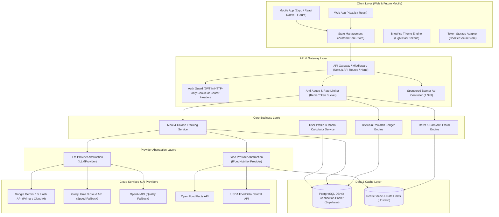

# BiteWise - System Architecture Specification (`ARCHITECTURE.md`)

## 1. System Overview & Core Principles

BiteWise is designed as an agentic, cloud-powered nutrition and meal tracking platform built with a modular, decoupled architecture. The architecture guarantees high responsiveness across web and mobile platforms, resilient cloud AI integration, strict anti-abuse protections for gamified rewards, and a future-proof code-sharing structure for React Native / Expo.

### Key Architectural Principles
1. **Cloud-Only AI & Multi-Provider Resiliency**: Rely strictly on cloud-hosted LLM APIs with tool-calling capabilities. Zero local LLM runtime dependencies (no Ollama). Provider fallbacks ensure 99.9% uptime while staying within free-tier limits.
2. **Strict Layer Separation & Abstractions**: Decouple business logic from external dependencies (LLM APIs, Nutrition DBs, Database drivers) via TypeScript interface abstractions (`ILLMProvider`, `IFoodNutritionProvider`, `ITokenStorage`).
3. **Cross-Platform Readiness (React Native / Expo)**: Business logic, state management, API clients, and TypeScript schemas reside in standard headless packages (`@bitwise/core` / `@bitwise/api-client`), isolating web UI components from core platform logic. Platform-specific features (Token Storage, Device Fingerprinting) use abstract adapters.
4. **Immutable Gamification Ledger**: BiteCoins transactions utilize a double-entry ledger architecture backed by automated anti-abuse fraud engines and idempotent reference keys.
5. **Clean Aesthetic & User-Centric Design**: Unified design token system implementing the BiteWise signature palette across light and dark modes with mobile viewport safe-area handling (`100dvh`).

---

## 2. High-Level Architecture Diagram



---

## 3. Frontend Architecture & Design System

### 3.1 Tech Stack & Structure
- **Framework**: Next.js 14+ (App Router) with React 18+ (TypeScript).
- **State Management**: **Zustand** (lightweight, zero boilerplate, reactive state engine outside React render tree, ideal for cross-platform sharing).
- **Validation**: **Zod** (shared client/server validation schemas).
- **Icons & UI Utilities**: Lucide React, Framer Motion (micro-animations), Class Variance Authority (CVA).

### 3.2 BiteWise Design Tokens & Color Palette
The UI system enforces strict CSS custom properties for effortless light/dark switching, WCAG AA contrast compliance, and mobile safe-area responsiveness.

| Element | Light Mode Token | Dark Mode Token | HEX (Light) | HEX (Dark) |
|---|---|---|---|---|
| **Background (Primary)** | `--bg-primary` | `--bg-primary` | `#FAF8F5` (Soft Cream) | `#121824` (Deep Slate) |
| **Background (Card/Surface)** | `--bg-surface` | `--bg-surface` | `#FFFFFF` (Pure White) | `#1E293B` (Charcoal) |
| **Primary Brand** | `--brand-primary` | `--brand-primary` | `#FF8A65` (Warm Peach) | `#FF8A65` (Warm Peach) |
| **Primary Accent** | `--brand-accent` | `--brand-accent` | `#81D4FA` (Soft Blue) | `#38BDF8` (Vibrant Blue) |
| **Text Primary** | `--text-primary` | `--text-primary` | `#1E293B` (Slate) | `#F8FAFC` (Off-white) |
| **Text Secondary** | `--text-secondary` | `--text-secondary` | `#64748B` (Muted Slate) | `#94A3B8` (Muted Grey) |
| **BiteCoin Gold** | `--coin-gold` | `--coin-gold` | `#F59E0B` (Amber Gold) | `#FBBF24` (Bright Gold) |

### 3.3 Mobile Safe-Area & Viewport Handling
- Use `100dvh` (dynamic viewport height) for full-screen web views to eliminate mobile browser URL bar jumpiness.
- All interactive touch targets enforce a minimum height/width of `44px x 44px`.
- Dedicated safe area spacing at the bottom of the screen (`padding-bottom: env(safe-area-inset-bottom)`) so fixed elements (such as bottom navigation and the Sponsored Banner) never obscure each other or native system home bars.

### 3.4 Cross-Platform Compatibility (Expo / React Native Strategy)
To support **future React Native / Expo compilation** without refactoring backend integration or state logic:
1. **Core Package Separation (`@bitwise/core`)**:
   - Stores all Zod schemas, API endpoints, Zustand stores, utility hooks, and domain logic.
   - Zero DOM or browser-specific references (`window`, `document`, `localStorage` abstracted via interfaces).
2. **Abstract Token Storage (`ITokenStorage`)**:
   - Web implementation: Secure HTTP-Only Cookie / `js-cookie`.
   - Native implementation: `expo-secure-store`.
3. **Decoupled API Client (`@bitwise/api-client`)**:
   - Universal `fetch` wrapper supporting both Web Fetch API and React Native Fetch.

---

## 4. Backend & Service Layer Architecture

### 4.1 Layered Architecture Pattern
The backend implements Hexagonal Architecture (Ports and Adapters):
```
[HTTP / REST Controller] ──> [Application Service] ──> [Domain Model]
                                     │                     │
                                     ▼                     ▼
                             [Port Interfaces]    [Database / External APIs]
                             (ILLMProvider, etc.) (Adapters)
```

### 4.2 LLM Provider Abstraction (`ILLMProvider`)
Strict Cloud-Only AI architecture. No Ollama or local LLMs. Supports Multimodal (Image) processing for food image recognition.
```typescript
export interface ILLMMessagePart {
  text?: string;
  imagePart?: {
    mimeType: string;
    dataBase64: string;
  };
}

export interface ILLMMessage {
  role: 'system' | 'user' | 'assistant' | 'tool';
  parts: ILLMMessagePart[];
  toolCalls?: IToolCall[];
  toolCallId?: string;
}

export interface ILLMResponse {
  content: string;
  toolCalls?: IToolCall[];
  usage: { promptTokens: number; completionTokens: number };
  providerName: string;
}

export interface ILLMProvider {
  readonly providerId: string;
  generateText(messages: ILLMMessage[], options?: ILLMOptions): Promise<ILLMResponse>;
  generateStructuredJSON<T>(messages: ILLMMessage[], schema: object): Promise<T>;
  executeToolCalls(messages: ILLMMessage[], tools: IAgentTool[]): Promise<ILLMResponse>;
}
```

#### Provider Fallback Chain
1. **Primary**: Google Gemini 1.5 Flash (Fast, high context, multimodal image support, cost-effective tool calling).
2. **Secondary Fallback**: Groq (Llama-3.3-70b-Versatile / Cloud hosted API for low latency text).
3. **Tertiary Fallback**: OpenAI GPT-4o-mini (Reliable backup).

### 4.3 Food & Nutrition Provider Abstraction (`IFoodNutritionProvider`)
```typescript
export interface IFoodItem {
  id: string;
  name: string;
  brand?: string;
  barcode?: string;
  servingSizeGrams: number;
  calories: number;
  proteinGrams: number;
  carbsGrams: number;
  fatGrams: number;
  fiberGrams?: number;
  micros?: Record<string, number>;
  sourceProvider: string;
  allergenFlags?: string[];
}

export interface IFoodNutritionProvider {
  readonly providerName: string;
  searchFoods(query: string, limit?: number): Promise<IFoodItem[]>;
  getByBarcode(barcode: string): Promise<IFoodItem | null>;
  getNutritionalDetails(foodId: string): Promise<IFoodItem | null>;
}
```

---

## 5. BiteCoins, Refer & Earn, Anti-Abuse Architecture

### 5.1 Immutable Double-Entry Ledger & Idempotency
All BiteCoins transactions are audited via an immutable ledger table (`bitecoin_ledger`). Balance is calculated from transaction sums or updated atomically via PostgreSQL triggers. Unique idempotency keys `(user_id, reference_type, reference_id, transaction_type)` prevent double reward payouts.

### 5.2 Anti-Abuse & Fraud Prevention Architecture
1. **Rate Limiting Guard**: Token Bucket algorithm in Redis (e.g. max 5 AI meal parses / minute, 30 / hour per user to respect Gemini free-tier limits).
2. **Proxy-Aware IP Detection**: Extract real client IP via validated platform headers (`x-real-ip`, `cf-connecting-ip`, or `x-forwarded-for` first entry) to prevent rate-limit spoofing.
3. **Referral Fraud Prevention Engine**:
   - **Device & IP Fingerprinting**: Hashes `User-Agent`, `Accept-Language`, and client IP subnet. Prevents multiple signups from the same fingerprint within 24 hours.
   - **Verification Gate**: Referral rewards are held in `PENDING` state until the referee verifies email AND completes at least 3 genuine meal logs.
   - **Daily Coin Cap**: Max 100 BiteCoins earnable per user/day from non-purchase activities.
4. **Prompt Injection Defense**:
   - All user text passed to LLM tool calls is sanitized and encapsulated within `<user_input>` XML tags. System instructions strictly enforce system role precedence.

---

## 6. Single Sponsored Banner Container Strategy

To maintain a clean, premium visual aesthetic while fulfilling monetization requirements:
- **Placement Policy**: Exactly **ONE small Sponsored Banner widget** rendered in the application layout.
- **Location Options**:
  - Desktop: Integrated into the bottom right of the main dashboard sidebar.
  - Mobile: Positioned inline within the daily meal feed card list or above the bottom nav with safe-area padding. Never floating over interactive UI elements.
- **Privacy & Performance**: Served via privacy-preserving ad server API / static partner deals with zero dynamic client tracking scripts, lazy loaded to ensure zero cumulative layout shift (CLS).
