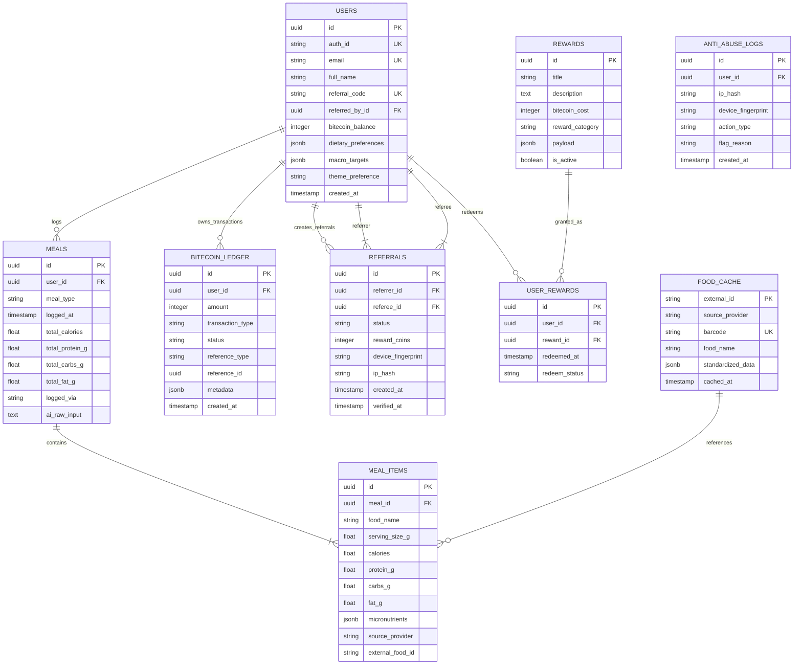

# BiteWise - Database Architecture Specification (`DATABASE.md`)

## 1. Overview & Technology Selection

BiteWise utilizes a dual-tier data architecture designed for reliability, fast lookup performance, and financial auditing of gamified BiteCoins:
1. **Primary Relational Database**: **PostgreSQL** (Hosted via Supabase or Neon free tier). Connection Pooling must use Supabase Transaction Pooler (port `6543`) or Supabase HTTP API to avoid exceeding free-tier serverless connection limits (~60 connections).
2. **In-Memory Cache & Key-Value Store**: **Redis** (Hosted via Upstash free tier). Handles API rate-limiting token buckets, session metadata, AI tool response caching, and anti-abuse IP/device frequency counters.

---

## 2. Entity-Relationship Diagram (ERD)



---

## 3. Detailed Table Schemas & Extensions

### 3.1 Extensions Setup
Must enable `pg_trgm` extension for trigram similarity index on cached food searches.

```sql
CREATE EXTENSION IF NOT EXISTS "uuid-ossp";
CREATE EXTENSION IF NOT EXISTS "pg_trgm";
```

### 3.2 `users` Table
Stores core user account data, target nutritional profiles, and current BiteCoin balance cache.

```sql
CREATE TABLE users (
    id UUID PRIMARY KEY DEFAULT gen_random_uuid(),
    auth_id VARCHAR(128) UNIQUE NOT NULL,
    email VARCHAR(255) UNIQUE NOT NULL,
    full_name VARCHAR(100),
    referral_code VARCHAR(12) UNIQUE NOT NULL,
    referred_by_id UUID REFERENCES users(id) ON DELETE SET NULL,
    bitecoin_balance INTEGER NOT NULL DEFAULT 0 CHECK (bitecoin_balance >= 0),
    dietary_preferences JSONB DEFAULT '{"vegan": false, "keto": false, "allergies": []}'::jsonb,
    macro_targets JSONB DEFAULT '{"daily_calories": 2000, "protein_g": 150, "carbs_g": 200, "fat_g": 65}'::jsonb,
    theme_preference VARCHAR(10) DEFAULT 'system' CHECK (theme_preference IN ('light', 'dark', 'system')),
    created_at TIMESTAMPTZ DEFAULT CURRENT_TIMESTAMP,
    updated_at TIMESTAMPTZ DEFAULT CURRENT_TIMESTAMP
);

CREATE INDEX idx_users_auth_id ON users(auth_id);
CREATE INDEX idx_users_referral_code ON users(referral_code);
```

### 3.3 `meals` & `meal_items` Tables
Stores top-level meal events and granular food item breakdowns.

```sql
CREATE TABLE meals (
    id UUID PRIMARY KEY DEFAULT gen_random_uuid(),
    user_id UUID NOT NULL REFERENCES users(id) ON DELETE CASCADE,
    meal_type VARCHAR(20) NOT NULL CHECK (meal_type IN ('breakfast', 'lunch', 'dinner', 'snack')),
    logged_at TIMESTAMPTZ NOT NULL DEFAULT CURRENT_TIMESTAMP,
    total_calories NUMERIC(7,2) NOT NULL DEFAULT 0.00,
    total_protein_g NUMERIC(6,2) NOT NULL DEFAULT 0.00,
    total_carbs_g NUMERIC(6,2) NOT NULL DEFAULT 0.00,
    total_fat_g NUMERIC(6,2) NOT NULL DEFAULT 0.00,
    logged_via VARCHAR(20) NOT NULL CHECK (logged_via IN ('ai_text', 'ai_photo', 'barcode', 'manual')),
    ai_raw_input TEXT,
    created_at TIMESTAMPTZ DEFAULT CURRENT_TIMESTAMP
);

CREATE INDEX idx_meals_user_logged ON meals(user_id, logged_at DESC);

CREATE TABLE meal_items (
    id UUID PRIMARY KEY DEFAULT gen_random_uuid(),
    meal_id UUID NOT NULL REFERENCES meals(id) ON DELETE CASCADE,
    food_name VARCHAR(255) NOT NULL,
    serving_size_g NUMERIC(7,2) NOT NULL DEFAULT 100.00,
    calories NUMERIC(7,2) NOT NULL DEFAULT 0.00,
    protein_g NUMERIC(6,2) NOT NULL DEFAULT 0.00,
    carbs_g NUMERIC(6,2) NOT NULL DEFAULT 0.00,
    fat_g NUMERIC(6,2) NOT NULL DEFAULT 0.00,
    micronutrients JSONB DEFAULT '{}'::jsonb,
    source_provider VARCHAR(50) DEFAULT 'internal',
    external_food_id VARCHAR(100),
    created_at TIMESTAMPTZ DEFAULT CURRENT_TIMESTAMP
);

CREATE INDEX idx_meal_items_meal_id ON meal_items(meal_id);
```

### 3.4 `food_cache` Table
Minimizes external API latency and rate limits by caching normalized food items from USDA and Open Food Facts.

```sql
CREATE TABLE food_cache (
    external_id VARCHAR(128) PRIMARY KEY,
    source_provider VARCHAR(50) NOT NULL,
    barcode VARCHAR(64) UNIQUE,
    food_name VARCHAR(255) NOT NULL,
    standardized_data JSONB NOT NULL,
    cached_at TIMESTAMPTZ DEFAULT CURRENT_TIMESTAMP
);

CREATE INDEX idx_food_cache_barcode ON food_cache(barcode) WHERE barcode IS NOT NULL;
CREATE INDEX idx_food_cache_name_trgm ON food_cache USING gin (food_name gin_trgm_ops);
```

### 3.5 `bitecoin_ledger` Table
Double-entry accounting ledger tracking all BiteCoins credit and debit movements with strict idempotency constraint.

```sql
CREATE TABLE bitecoin_ledger (
    id UUID PRIMARY KEY DEFAULT gen_random_uuid(),
    user_id UUID NOT NULL REFERENCES users(id) ON DELETE CASCADE,
    amount INTEGER NOT NULL, -- Positive for EARN, negative for REDEEM
    transaction_type VARCHAR(35) NOT NULL CHECK (transaction_type IN (
        'EARN_MEAL_LOG', 'EARN_STREAK_BONUS', 'EARN_REFERRAL_BONUS', 'EARN_CHALLENGE', 'EARN_MILESTONE', 'REDEEM_REWARD', 'ADMIN_ADJUSTMENT'
    )),
    status VARCHAR(20) NOT NULL DEFAULT 'COMPLETED' CHECK (status IN ('PENDING', 'COMPLETED', 'CANCELLED')),
    reference_type VARCHAR(30), -- e.g. 'MEAL', 'REFERRAL', 'CHALLENGE', 'USER_REWARD'
    reference_id UUID,
    metadata JSONB DEFAULT '{}'::jsonb,
    created_at TIMESTAMPTZ DEFAULT CURRENT_TIMESTAMP,
    CONSTRAINT uq_ledger_idempotency UNIQUE (user_id, reference_type, reference_id, transaction_type)
);

CREATE INDEX idx_ledger_user_status ON bitecoin_ledger(user_id, status, created_at DESC);
```

### 3.6 `referrals` Table
Enforces anti-fraud and tracks inviter/invitee rewards.

```sql
CREATE TABLE referrals (
    id UUID PRIMARY KEY DEFAULT gen_random_uuid(),
    referrer_id UUID NOT NULL REFERENCES users(id) ON DELETE CASCADE,
    referee_id UUID UNIQUE NOT NULL REFERENCES users(id) ON DELETE CASCADE,
    status VARCHAR(20) NOT NULL DEFAULT 'PENDING' CHECK (status IN ('PENDING', 'VERIFIED', 'FLAGGED', 'EXPIRED')),
    reward_coins INTEGER NOT NULL DEFAULT 50,
    device_fingerprint VARCHAR(128),
    ip_hash VARCHAR(64),
    created_at TIMESTAMPTZ DEFAULT CURRENT_TIMESTAMP,
    verified_at TIMESTAMPTZ
);

CREATE INDEX idx_referrals_referrer ON referrals(referrer_id);
CREATE INDEX idx_referrals_fingerprint ON referrals(device_fingerprint, ip_hash);
```

---

## 4. Atomic Database Triggers

To prevent race conditions and balance tampering, `users.bitecoin_balance` is automatically kept in sync using PostgreSQL triggers on `bitecoin_ledger`.

```sql
CREATE OR REPLACE FUNCTION update_user_bitecoin_balance()
RETURNS TRIGGER AS $$
BEGIN
    IF (TG_OP = 'INSERT' AND NEW.status = 'COMPLETED') THEN
        UPDATE users
        SET bitecoin_balance = bitecoin_balance + NEW.amount,
            updated_at = CURRENT_TIMESTAMP
        WHERE id = NEW.user_id;
    ELSIF (TG_OP = 'UPDATE' AND OLD.status = 'PENDING' AND NEW.status = 'COMPLETED') THEN
        UPDATE users
        SET bitecoin_balance = bitecoin_balance + NEW.amount,
            updated_at = CURRENT_TIMESTAMP
        WHERE id = NEW.user_id;
    ELSIF (TG_OP = 'UPDATE' AND OLD.status = 'COMPLETED' AND NEW.status = 'CANCELLED') THEN
        UPDATE users
        SET bitecoin_balance = bitecoin_balance - OLD.amount,
            updated_at = CURRENT_TIMESTAMP
        WHERE id = OLD.user_id;
    END IF;
    RETURN NEW;
END;
$$ LANGUAGE plpgsql;

CREATE TRIGGER trg_bitecoin_balance_update
AFTER INSERT OR UPDATE ON bitecoin_ledger
FOR EACH ROW
EXECUTE FUNCTION update_user_bitecoin_balance();
```

---

## 5. Redis Caching & Rate-Limiting Schema

| Redis Key Pattern | Data Type | TTL | Purpose |
|---|---|---|---|
| `rate:ai_meal:<user_id>` | Integer Counter | 60s (1m) / 3600s (1h) | Max 5 req/min, 30 req/h (Gemini free-tier protection) |
| `rate:referral:<ip_hash>` | Integer Counter | 86400s (24h) | Max 3 referral signups per IP per day |
| `cache:barcode:<barcode_id>` | JSON String | 604800s (7d) | Caches barcode nutrition data |
| `session:active:<user_id>` | Hash | 86400s (24h) | Active user session metadata |
