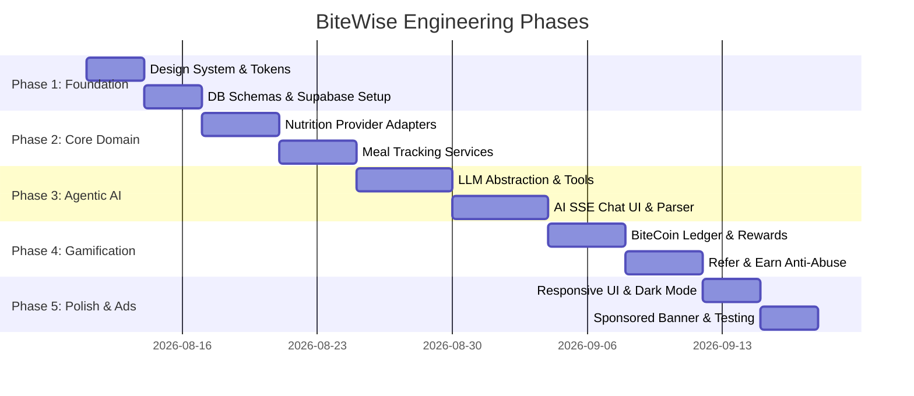

# BiteWise - Development & Implementation Plan (`DEVELOPMENT_PLAN.md`)

## 1. Executive Summary & Recommended Free-Tier Stack

This document outlines the phased execution strategy for BiteWise. The proposed architecture is structured to operate seamlessly within **generous free-tier cloud services** while delivering a responsive, agentic AI food tracking experience.

### Recommended Free-Tier Stack Architecture

| Layer | Service / Technology | Free-Tier Limits & Capabilities | Cost |
|---|---|---|---|
| **Hosting & Web UI** | **Vercel** (Next.js App Router) | 100 GB bandwidth, Serverless functions, Automatic CI/CD | $0 / mo |
| **Primary Database & Auth** | **Supabase** (PostgreSQL) | 500 MB Postgres DB, 50,000 MAU Auth, Row Level Security | $0 / mo |
| **Cache & Rate Limiting** | **Upstash Redis** | 10,000 commands / day, Serverless REST API | $0 / mo |
| **Primary AI Engine** | **Google Gemini API** (Gemini 1.5 Flash) | 15 RPM, 1,000,000 TPM, 1,500 RPD (Free Tier) | $0 / mo |
| **Fallback AI Engine** | **Groq API** (Llama-3.3-70B) | 30 RPM, 14,400 RPD (Free Tier) | $0 / mo |
| **Nutrition Data 1** | **Open Food Facts API** | Unlimited open-source global food & barcode database | $0 / mo |
| **Nutrition Data 2** | **USDA FoodData Central API** | 1,000 requests / hour with free API key | $0 / mo |
| **Monetization** | **Self-Hosted Sponsored Banner Slot** | 1 non-intrusive ad slot, zero third-party script overhead | $0 / mo |

---

## 2. Development Roadmap & Phased Implementation

---

## 3. Phase Breakdown & Deliverables

### Phase 1: System Foundation & Design Token Architecture
- **Deliverables**:
  1. Monorepo / modular directory structure (`@bitwise/core` logic, web client UI).
  2. Implement BiteWise design system CSS variables (Warm Peach `#FF8A65`, Soft Cream `#FFFDD0`, Soft Blue `#81D4FA`, Slate/Charcoal Dark Mode `#121824`).
  3. Set up PostgreSQL schema migrations in Supabase (`users`, `meals`, `meal_items`, `food_cache`, `bitecoin_ledger`, `referrals`, `rewards`).
  4. Configure Zustand core store for global user state, theme switching, and offline hydration.

### Phase 2: Food & Nutrition Data Abstraction
- **Deliverables**:
  1. Implement `IFoodNutritionProvider` interface.
  2. Build **Open Food Facts Adapter** for barcode scan resolution.
  3. Build **USDA FoodData Central Adapter** for generic raw ingredient queries.
  4. Implement `food_cache` database repository to store and index queries for fast response times.
  5. Build manual meal log CRUD endpoints and frontend logging forms.

### Phase 3: Agentic AI Engine & Tool Calling
- **Deliverables**:
  1. Implement `ILLMProvider` interface for **Google Gemini 1.5 Flash** (Primary) and **Groq Llama 3** (Fallback).
  2. Implement agent tools: `search_food_database`, `calculate_macros`, `log_meal`, `analyze_recipe`, `generate_meal_plan`.
  3. Build SSE streaming endpoint (`/api/v1/ai/chat`) and natural language meal parser.
  4. Build interactive AI Chat Interface with real-time tool invocation visualizer and one-click meal logging.

### Phase 4: BiteCoins Gamification, Refer & Earn, Anti-Abuse
- **Deliverables**:
  1. Implement double-entry ledger service (`bitecoin_ledger`) with atomic PostgreSQL balance trigger.
  2. Implement daily logging streak detector and reward distribution.
  3. Build Refer & Earn engine with unique referral links and reward payout logic.
  4. Implement Anti-Abuse Guard (Upstash Redis rate-limiter, IP/device fingerprinting, referee validation gates).
  5. Build Reward Store UI and redemption API endpoint.

### Phase 5: Single Sponsored Banner, UI Polish & Cross-Platform Audit
- **Deliverables**:
  1. Integrate exactly **ONE small Sponsored Banner** component on the dashboard sidebar / mobile feed bottom.
  2. Complete responsive breakpoint audit across Desktop (1440px+), Tablet (768px - 1024px), and Mobile (375px - 430px).
  3. Complete Light & Dark Mode accessibility check (WCAG contrast ratios).
  4. Verify React Native / Expo compatibility of `@bitwise/core` packages (ensure zero web-only API leaks in core logic).

---

## 4. Risk Matrix & Mitigation Strategies

| Potential Risk | Severity | Impact Area | Engineering Mitigation Strategy |
|---|---|---|---|
| **AI Rate Limit Exceeded on Free Tier** | Medium | Agentic AI Chat | Automatic failover from Gemini 1.5 Flash -> Groq Llama 3 -> OpenAI GPT-4o-mini; Redis response caching for identical food prompt queries. |
| **Referral Bot Abuse & Fake Accounts** | High | BiteCoins Economy | Enforce IP subnet limit, device fingerprint hashing, and delay referral payout until referee completes 3 valid meal logs. |
| **Nutrition API Downtime / Latency** | Medium | Food Search & Barcode | Multi-provider fallback (Open Food Facts <-> USDA) + local PostgreSQL `food_cache` index. |
| **Prompt Injection Attacks** | High | Tool Calling Security | Encapsulate user queries in XML tags; enforce strict Zod schema validation on tool call parameters before execution. |
